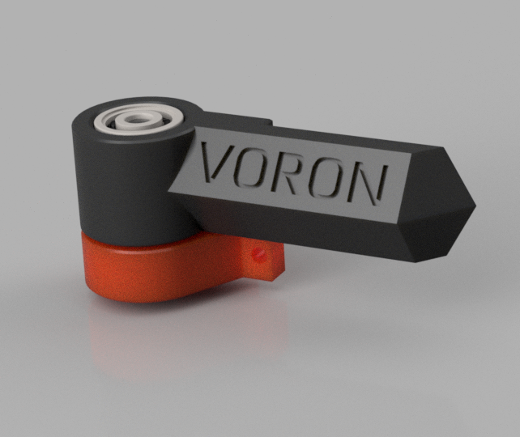
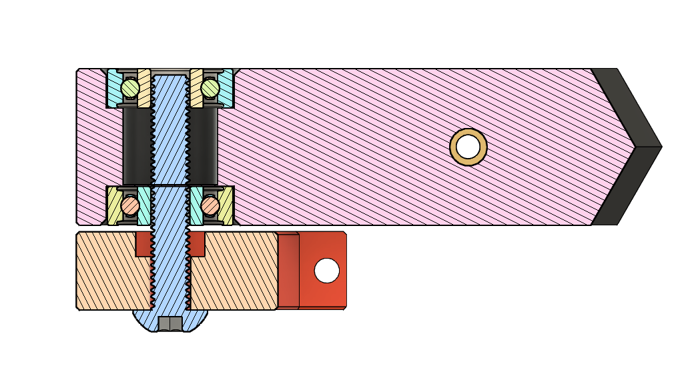

# Removable panel hinges

Panel hinges that enable you to remove the panel at will.
They are spaced for 3mm thick panels and 3mm foam.

## Materials per hinge

- 2x 625 Bearing
- 1x M5x30 BHCS
- 1x M5 nut
- 2x M3x10 SHCS (BHCS might fit, did not have those)
- 2x M3 T-nut

Optional if you want to screw it on:

- M3 heat insert
- M3x8 BHCS

